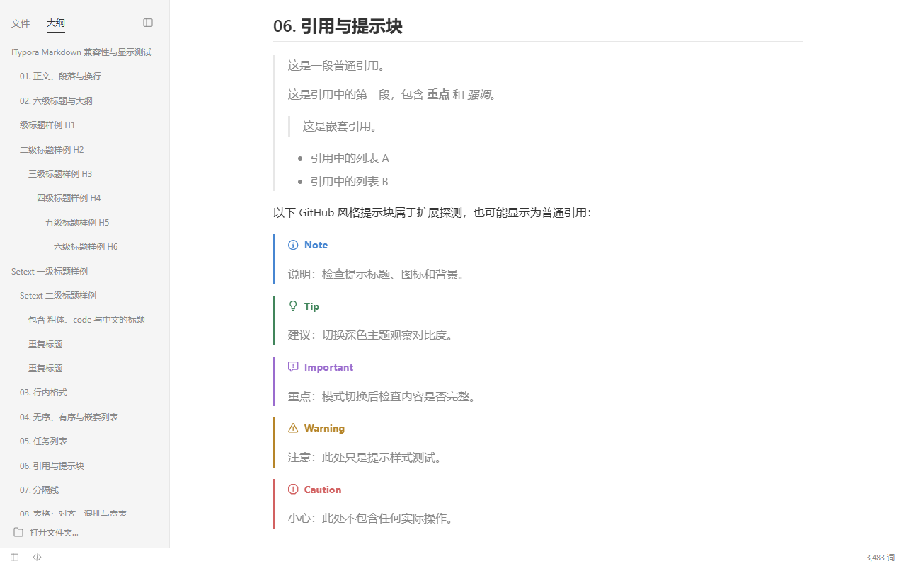
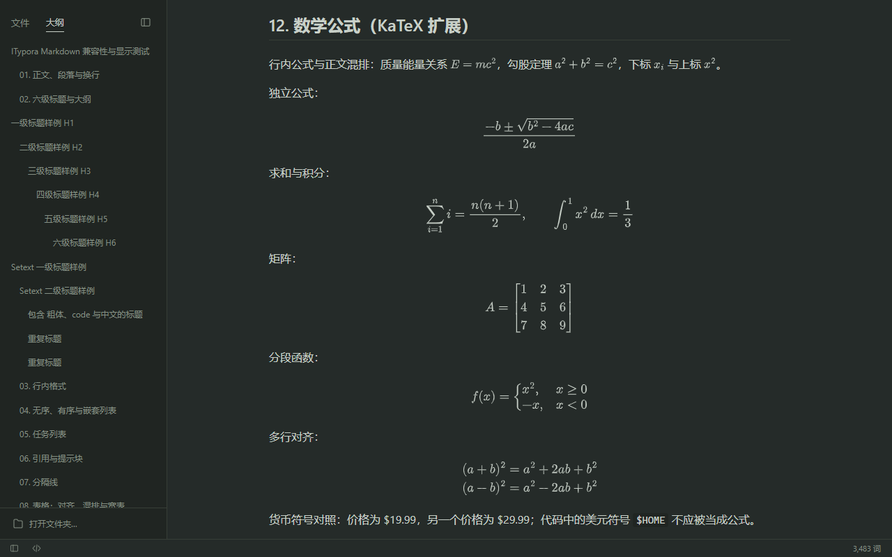

# Itypora

[](https://github.com/lhyf/ITypora/actions/workflows/build.yml)
[](https://github.com/lhyf/ITypora/releases)
[](LICENSE)

[简体中文](README.md) | English

A local-first Markdown desktop editor with live-preview, WYSIWYG and source modes. It imports Typora CSS themes and exports HTML and PDF. Runs on Windows, macOS and Linux.

Itypora is an independent implementation built on Electron and Vditor, with its own interface and assets. **It is not affiliated with Typora.** The interface is currently in Chinese.



<details>
<summary>Dark theme screenshot</summary>



</details>

## Download

Get the latest version from [Releases](https://github.com/lhyf/ITypora/releases):

| System | File |
| --- | --- |
| Windows 10/11 x64 | `Itypora-<version>-win-x64-setup.exe` (installer) or `Itypora-<version>-win-x64-portable.exe` (portable) |
| macOS (Apple silicon) | `Itypora-<version>-mac-arm64.dmg` |
| macOS (Intel) | `Itypora-<version>-mac-x64.dmg` |
| Linux x64 | `Itypora-<version>-linux-x86_64.AppImage` or `Itypora-<version>-linux-amd64.deb` |

The installers are not code-signed yet, so the system may block the first launch:

- **Windows**: when SmartScreen says "Windows protected your PC", choose *More info → Run anyway*.
- **macOS**: after moving Itypora to Applications, run once in Terminal:
  `xattr -dr com.apple.quarantine /Applications/Itypora.app`
- **Linux**: make the AppImage executable (`chmod +x Itypora-*.AppImage`). Some distributions (e.g. Ubuntu 24.04) restrict the sandbox; if it fails with a sandbox error, start it with `--no-sandbox` or install the `.deb` instead (`sudo apt install ./Itypora-*.deb`).

## Features

**Editing**

- Live preview (instant rendering), WYSIWYG and a separate source mode. Ctrl+/ switches to source and back while keeping the caret and scroll position.
- Source mode highlights Markdown the way Typora does (headings, emphasis, fenced code with language highlighting, quotes, lists, links, tables, YAML front matter) and uses Typora's CodeMirror class names, so a theme's source-mode styles apply.
- Headings, lists, task lists, tables, quotes, code blocks, math, Mermaid and other diagrams, footnotes, table of contents and GitHub-style alerts (`> [!NOTE]`).
- Paragraph and format menus shared by all three modes, with context-aware table, code, task and list commands.
- A table dialog that asks for columns and rows before inserting.
- Double-click a diagram, formula or image to view it enlarged: wheel zoom around the pointer, drag to pan, `+`/`-`, `0` to fit, `1` for actual size, Esc to close. Diagrams and formulas stay vector-sharp.

**Files and interface**

- Open a folder and browse its Markdown files as a list or grouped by directory; recent files, outline, find, word count.
- Focus and typewriter modes; a resizable sidebar that remembers its width.
- Native menus and an in-window preferences page (General, Appearance, Editor, Markdown) with search.

**Export** (File → Export)

- **HTML**: a single self-contained file with the theme's styles, fonts and local images embedded, diagrams and formulas as SVG and no scripts. Links, table of contents and footnotes work; as in Typora, footnotes gather at the end, `<details>` blocks expand, and HTML comments and YAML front matter are hidden.
- **PDF**: A4 pages in the theme's background colour, with heading bookmarks and clickable links, avoiding page breaks inside diagrams, images and code blocks.
- Export also works from source mode, using the current (even unsaved) text.

**Offline**: the editor, parser, MathJax, Mermaid and other rendering assets ship with the app; nothing loads from a CDN.

## Themes

Itypora imports CSS themes written for Typora and includes three colour schemes of its own.

1. Keep the theme's file layout, e.g. `my-theme.css` and `my-theme/fonts/`.
2. Choose *主题 (Theme) → 导入 CSS 主题… (Import CSS theme…)* and pick the entry `.css` file. Local `@import`s, images and fonts in the same folder or below are packed into a copy of the theme; the original files are not changed.
3. Switch themes from the Theme menu or in *Preferences → Appearance*.
4. `base.user.css` (the *Custom CSS* option) applies to every theme, and `<theme>.user.css` overrides a single theme.

Themes are checked against Typora (Matcha and others), but pixel-identical rendering for every theme is not guaranteed. Remote `@import`s, fonts and images are skipped with a warning. Third-party themes are not distributed with Itypora; follow each theme's license.

## Files and data

- An unchanged document keeps its exact bytes (including BOM and CRLF) across mode switches and saves. After editing in the rich modes, only the edited blocks are rewritten by the editor; the rest of the file is preserved byte for byte.
- UTF-8 documents up to 10 MB; other encodings and binary files are refused.
- Saves write a temporary file and replace atomically; a recovery draft is kept every second. If another program changes or deletes the file, saving asks before overwriting.
- Local images resolve against the document like in Typora: beside it, in subfolders, in parent folders (`../assets/a.png`) or by absolute path (`E:\pics\a.png`, `file:///…`). PNG, JPEG, GIF, WebP and AVIF up to 20 MB each.

## Keyboard shortcuts

| Action | Windows / Linux | macOS |
| --- | --- | --- |
| New / Open / Save | Ctrl+N / Ctrl+O / Ctrl+S | Cmd+N / Cmd+O / Cmd+S |
| Save as | Ctrl+Shift+S | Cmd+Shift+S |
| Toggle source mode | Ctrl+/ | Cmd+/ |
| Toggle sidebar | Ctrl+Shift+L | Cmd+Shift+L |
| Outline | Ctrl+Shift+1 | Cmd+Shift+1 |
| Find | Ctrl+F | Cmd+F |
| Preferences | Ctrl+, | Cmd+, |
| Focus / typewriter mode | F8 / F9 | F8 / F9 |
| Paragraph | Ctrl+0 | Cmd+0 |
| Promote / demote heading | Ctrl+= / Ctrl+- | Cmd+= / Cmd+- |
| Math block | Ctrl+Shift+M | Cmd+Shift+M |
| Underline / highlight | Ctrl+U / Ctrl+Shift+H | Cmd+U / Cmd+Shift+H |
| Zoom interface in / out | Ctrl+Shift+= / Ctrl+Shift+- | Cmd+Shift+= / Cmd+Shift+- |
| View a diagram, formula or image enlarged | Double-click | Double-click |

## Building from source

Requires Node.js 22.12 or later (developed with Node.js 24).

```sh
git clone https://github.com/lhyf/ITypora.git
cd ITypora
npm ci
npm run desktop     # build and start the desktop app
```

- `npm run dev` previews the interface in a browser (folders, drafts and theme import need the desktop app).
- `npm run pack` produces a runnable folder, e.g. `release/win-unpacked/Itypora.exe`.
- `npm run dist` builds installers for the current system.

Tests: `npm test` runs the unit tests; `npm run test:desktop`, `test:rendering`, `test:export` and the other `test:*` scripts drive the real Electron app (see `package.json`).

## Continuous builds and releases

GitHub Actions ([`.github/workflows/build.yml`](.github/workflows/build.yml)) runs the unit tests and packages Itypora on Windows, macOS and Linux for every push and pull request; the installers are attached to the run as artifacts. Pushing a `v*` tag (for example `v0.4.0`) also publishes a GitHub Release with all installers and the matching section of [CHANGELOG.md](CHANGELOG.md). See [CONTRIBUTING.md](CONTRIBUTING.md) for the release steps.

## Known limitations

- Installers are unsigned, macOS builds are not notarized, and there is no auto-update.
- Remote images and SVG images in documents are not loaded yet; export has no paper, margin or header/footer options.
- Development and the full test suite run on Windows; macOS and Linux builds come from CI. Reports from those systems are welcome.

## Contributing

Issues and pull requests are welcome; see [CONTRIBUTING.md](CONTRIBUTING.md). Please report security issues privately as described in [SECURITY.md](SECURITY.md).

## License

[MIT](LICENSE). Third-party components and their licenses are listed in [THIRD_PARTY_NOTICES.md](THIRD_PARTY_NOTICES.md).

Typora is a trademark of its owner. Itypora is an independent project and contains no Typora code, assets or bundled themes.
