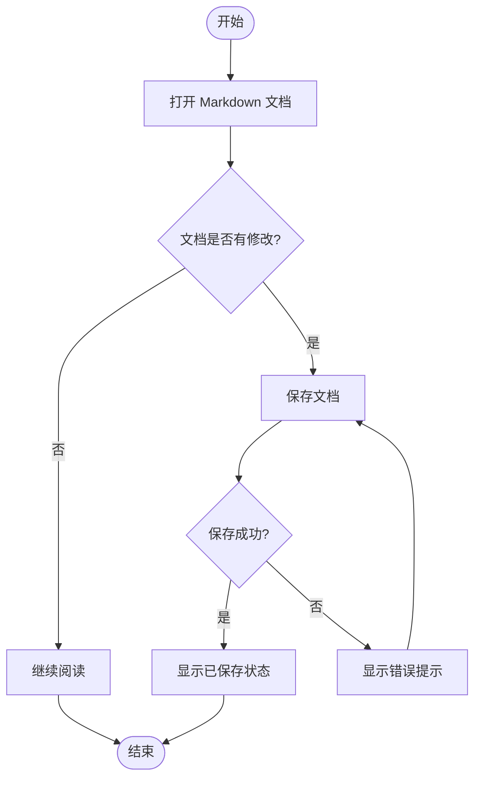
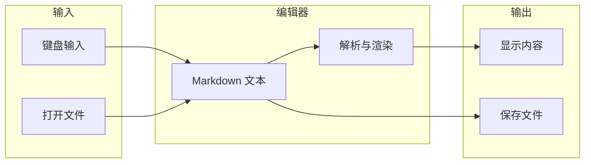
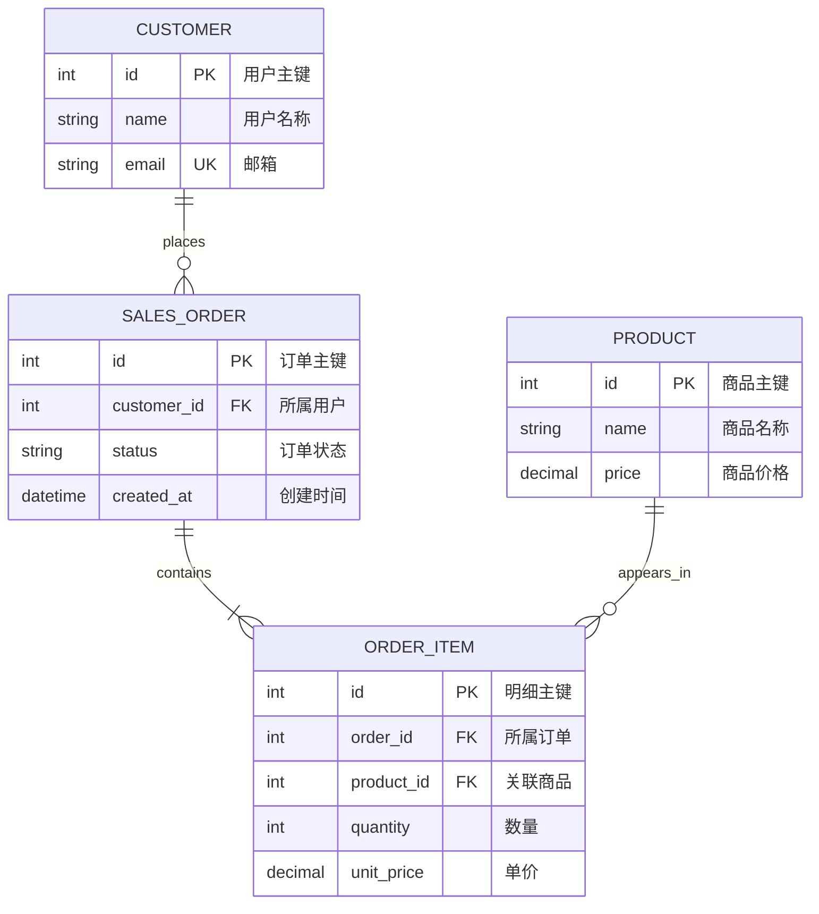
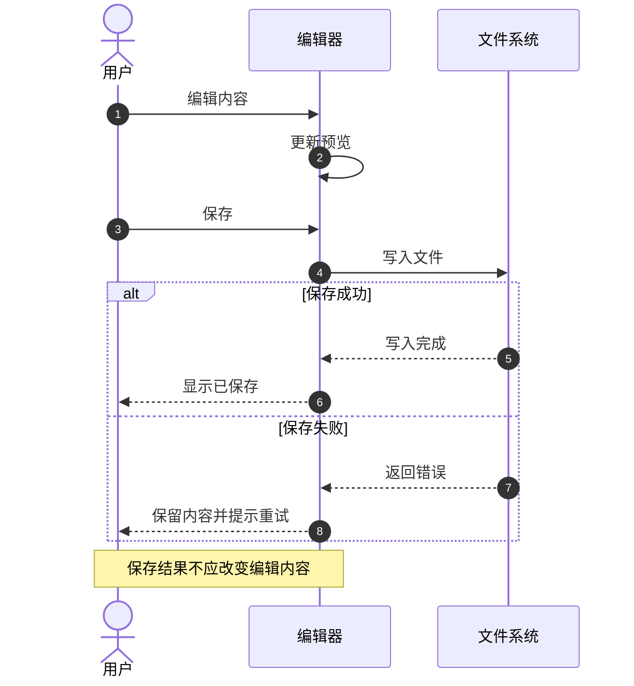
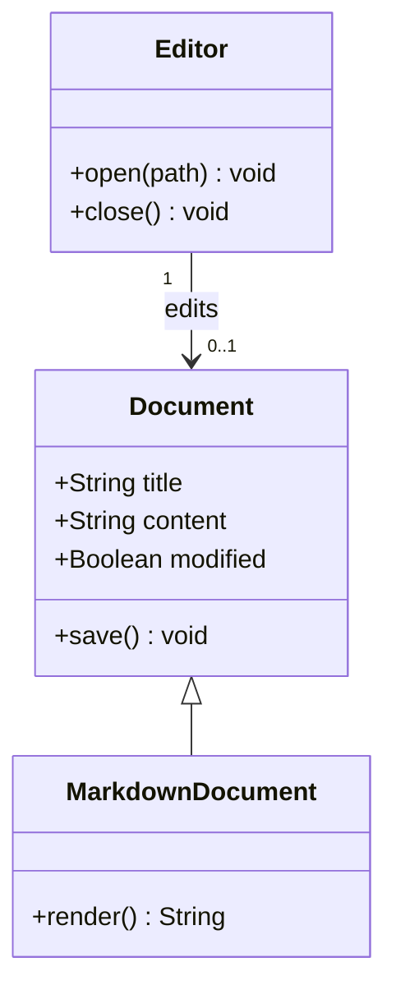
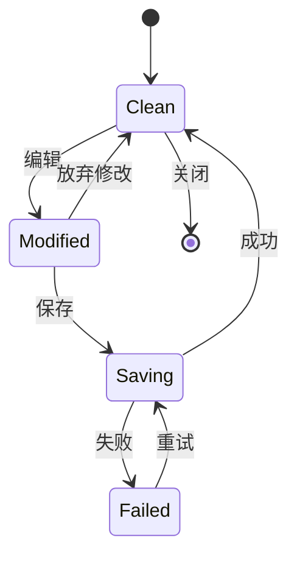
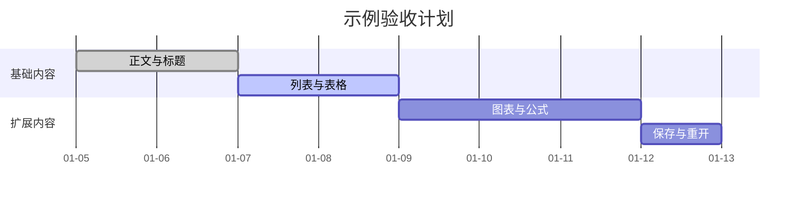
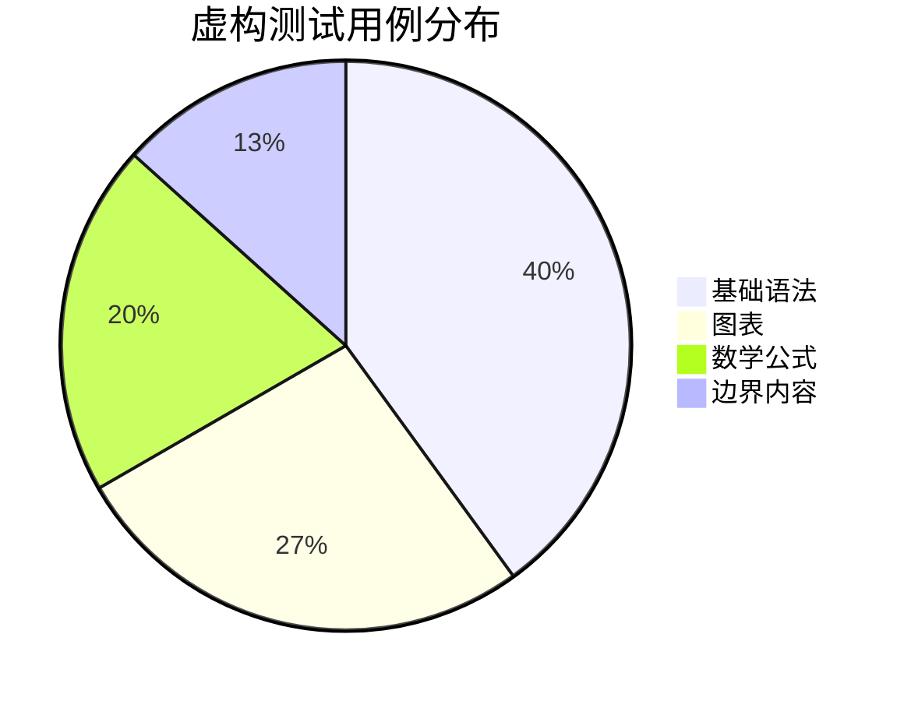

# ITypora Markdown 兼容性与显示测试

这是一份可以直接在 ITypora 中打开的人工验收样本。包含基础 Markdown、常用扩展、Mermaid 图表、数学公式、内嵌 HTML 和边界内容。

**使用方法：**先观察渲染，再 分别切换即时渲染、所见即所得和源码模式；尝试浅色、深色主题及窄窗口。需要修改时，建议先“另存为”一个测试副本，再验证保存、关闭、重新打开是否保留内容。

**如何判断结果：**基础语法应正常显示；标记为“扩展探测”的内容取决于解析器和配置，显示为原文不一定是故障。记录为“通过 / 异常 / 不支持 / 未测”，不要将示例复选框当成测试已通过。

**项目现状参考：**当前项目配置使用 Vditor 与 KaTeX，并启用了 HTML 清理。本地图片支持文档所在目录及其子目录中的 PNG/JPEG/GIF/WebP/AVIF；父目录、远程及 SVG 文档图片尚未开放。以下专门包含这些限制的探测项。

## 01. 正文、段落与换行

这是第一段普通正文。观察中文字体、字号、行高和段落间距。ITypora 是一个 Markdown 编辑器，文本中可以混排 English、数字 0123456789 与中文标点：“引号”、（括号）、《书名号》、省略号……以及破折号——。

这是第二段正文。一个段落中包含较多文字时，应按照编辑区宽度自然换行。请拖动窗口边缘并打开侧栏，确认正文不会被侧栏覆盖，左右留白不会突然消失，文字不会超出编辑区域。切换深色主题后，正文和背景仍应保持清晰的对比。

这一行与下一行之间只有一个源码换行。
这里用于观察软换行策略：有的配置会合并为空格，有的配置会保留换行。

这一行末尾有两个空格，预期产生硬换行。  
这句话应显示在下一行，但仍属于同一个段落。

这一行使用 HTML 换行。<br>这句话用于检查内嵌 `br` 的处理。

**检查点：**段落间距、软换行配置、硬换行是否保留；源码模式中行尾两个空格是否在编辑保存后丢失。

## 02. 六级标题与大纲

# 一级标题样例 H1

一级标题后的正文。

## 二级标题样例 H2

二级标题后的正文。

### 三级标题样例 H3

三级标题后的正文。

#### 四级标题样例 H4

四级标题后的正文。

##### 五级标题样例 H5

五级标题后的正文。

###### 六级标题样例 H6

六级标题后的正文。

Setext 一级标题样例
==================

Setext 二级标题样例
------------------

### 包含 **粗体**、`code` 与中文的标题

### 重复标题

第一个同名标题，用于检查大纲和锚点。

### 重复标题

第二个同名标题，用于检查定位是否混淆。

**检查点：**字号层级、标题间距、大纲缩进、同名标题定位。以上多个一级标题是有意设置的测试项。

## 03. 行内格式

| 格式 | 实际效果 |
| :--- | :--- |
| 星号粗体 | **这是一段粗体 Bold** |
| 下划线粗体 | __另一种粗体__ |
| 星号斜体 | *这是一段斜体 Italic* |
| 下划线斜体 | _另一种斜体_ |
| 粗斜体 | ***同时加粗并倾斜*** |
| 删除线（扩展） | ~~已废弃的内容~~ |
| 行内代码 | `const count = 3` |
| 组合格式 | **粗体中包含 *斜体* 与 `code`** |
| 中文紧邻标记 | 前文**重点**后文；前文*强调*后文 |
| 下划线标识符 | user_name、file_name_with_underscores |

扩展探测：==高亮文本==、H~2~O、x^2^。这些写法不是所有 Markdown 解析器都支持。

HTML 对照：<mark>高亮文本</mark>、H<sub>2</sub>O、x<sup>2</sup>、<u>下划线</u>、<kbd>Ctrl</kbd> + <kbd>S</kbd>。

**检查点：**格式是否正确嵌套；行内代码背景是否与主题协调；不支持的扩展是否保留原文。

## 04. 无序、有序与嵌套列表

- 无序列表第一项
- 无序列表第二项，包含 **粗体** 与 `code`
  - 二级列表 A
  - 二级列表 B
    - 三级列表，检查缩进
- 回到一级列表

* 使用星号的列表项
* 另一项

+ 使用加号的列表项
+ 另一项

1. 有序列表第一步
2. 有序列表第二步
   1. 子步骤一
   2. 子步骤二
3. 有序列表第三步

下面的列表刻意从 3 开始：

3. 第三步
4. 第四步
5. 第五步

下面是包含多个段落和代码块的列表：

1. 打开文档。

   这是第一项中的第二段，应该仍属于第一项。

   > 列表内部的引用。

2. 执行示例命令。

   ```sh
   echo "Hello ITypora"
   ```

3. 返回普通列表内容。

**检查点：**编号起始值、嵌套缩进、列表内段落和代码归属；回车续写和 Tab 缩进。

## 05. 任务列表

- [ ] 待办样例：检查标题显示
- [x] 已勾选样例：仅用于观察样式
- [ ] 包含子任务的父任务
  - [x] 子任务样例 A
  - [ ] 子任务样例 B
- [ ] 含 **粗体**、[链接](https://example.com) 和 `code` 的任务

**检查点：**复选框与文字对齐，勾选后源码 `[ ]` / `[x]` 是否变化，保存后状态是否保留。

## 06. 引用与提示块

> 这是一段普通引用。
>
> 这是引用中的第二段，包含 **重点** 和 *强调*。
>
> > 这是嵌套引用。
>
> - 引用中的列表 A
> - 引用中的列表 B

以下 GitHub 风格提示块属于扩展探测，也可能显示为普通引用：

> [!NOTE]
> 说明：检查提示标题、图标和背景。

> [!TIP]
> 建议：切换深色主题观察对比度。

> [!IMPORTANT]
> 重点：模式切换后检查内容是否完整。

> [!WARNING]
> 注意：此处只是提示样式测试。

> [!CAUTION]
> 小心：此处不包含任何实际操作。

## 07. 分隔线

下面使用三个短横线：

---

下面使用三个星号：

***

下面使用三个下划线：

___

**检查点：**分隔线颜色、宽度和上下间距；与 Setext 标题语法的区分。

## 08. 表格：对齐、混排与宽表

| 左对齐 | 居中对齐 | 右对齐 |
| :--- | :---: | ---: |
| 苹果 | A | 12.50 |
| 香蕉 | B | 3.00 |
| 合计 | — | **15.50** |

| 场景 | 内容 | 备注 |
| --- | --- | --- |
| 行内格式 | **粗体**、*斜体*、~~删除线~~ | 混合样式 |
| 代码 | `user.id` | 等宽字体 |
| 链接 | [示例链接](https://example.com) | 检查颜色 |
| 转义竖线 | A \| B | 应留在同一个单元格 |
| 代码中的竖线 | `a \| b` | GFM 扩展兼容性 |
| 多行内容 | 第一行<br>第二行 | HTML 换行探测 |
| 空单元格 | | 左边内容为空 |
| 长内容 | 这一格包含较长的中文文本，用于检查单元格换行、行高以及内容是否被截断。 | 自动换行 |

| 编号 | 项目名称 | 负责人 | 状态 | 开始日期 | 截止日期 | 进度 | 标签 | 文件路径 | 备注 |
| ---: | --- | --- | --- | --- | --- | ---: | --- | --- | --- |
| 1 | Markdown 兼容性 | 张三 | 进行中 | 2026-01-05 | 2026-01-09 | 75% | 编辑器 | `docs/compatibility/markdown-rendering-sample.md` | 测试窄窗口横向滚动 |
| 2 | 深色主题适配 | 李四 | 待检查 | 2026-01-08 | 2026-01-12 | 20% | 主题 | `src/styles/themes/dark-theme.css` | 检查边框和选中效果 |

**检查点：**对齐、边框、行高、空格子、转义竖线和宽表滚动；表格不应遮挡正文。

## 09. 链接、引用式链接与锚点

- 普通链接：[Example](https://example.com)
- 带标题的链接：[悬停查看标题](https://example.com "这是链接标题")
- 自动链接：<https://example.com/docs?q=markdown&lang=zh>
- 裸链接扩展：https://example.com
- 邮箱链接：<test@example.com>
- 引用式链接：[引用式示例][example-reference]
- 本文锚点：[跳转到英文锚点样例](#anchor-target)
- 含括号的地址：[括号路径示例](<https://example.com/docs/item_(sample)>)

### anchor-target

这是锚点目标。检查链接跳转后是否被顶部界面遮挡。自动标题锚点规则取决于解析器。

[example-reference]: https://example.com "引用式链接标题"

**检查点：**链接颜色、悬浮提示、编辑与打开链接的交互是否冲突。示例域名仅用于链接语法测试。

## 10. 图片与替代文字

下面引用随本文提供的本地 PNG。它包含彩色矩形、圆形与边框，便于观察比例、清晰度和背景。


下面用 HTML 设置同一图片的宽度，属于 HTML 支持探测：


下面测试文件名中的中文和空格，使用尖括号包住路径：


**故意缺失的图片：**以下文件不提供，用来观察失败占位、替代文字和页面布局是否稳定。


**受限来源探测：**以下是远程图片，当前项目限制下预期不加载。即使网络可用也不要将其误判为 PNG 渲染故障。


**检查点：**本地图片加载、等比缩放、窄窗口适配、标题提示、中文路径与失败占位。移动本文时请同时移动 `markdown-test-assets` 文件夹。

## 11. 行内代码与代码块

普通行内代码：`npm run dev`；代码中包含反引号：``const marker = `hello`;``。

### JavaScript 高亮

```javascript
// 中文注释、字符串、数字与模板字符串
const user = { name: "张三", active: true, score: 98.5 };
function greet({ name, score }) {
  return `你好，${name}！当前分数：${score}`;
}
console.log(greet(user));
```

### Python 高亮与缩进

```python
def summarize(values: list[int]) -> dict:
    """检查中文注释、四空格缩进与关键字颜色。"""
    total = sum(values)
    return {"count": len(values), "total": total}

print(summarize([1, 2, 3]))
```

### JSON 高亮

```json
{
  "name": "ITypora",
  "features": ["markdown", "mermaid", "math"],
  "enabled": true,
  "count": 3,
  "optional": null
}
```

### SQL 高亮

```sql
SELECT status, COUNT(*) AS total
FROM documents
WHERE updated_at >= '2026-01-01'
GROUP BY status
ORDER BY total DESC;
```

### diff 高亮

```diff
- const theme = "light";
+ const theme = "dark";
  renderDocument();
```

### 无语言标记的代码块

```
这里应保持原样：**不是粗体**，# 不是标题，<div>不是 HTML 元素</div>。
    前导空格应保留。
```

### 波浪线围栏

~~~text
波浪线代码块中的三个反引号应作为普通内容：
```
~~~

### 四空格缩进代码块

    第一行缩进代码
    第二行缩进代码
        第三行额外缩进

### 嵌套围栏与超长行

````markdown
# 这是代码块内部的 Markdown

```javascript
console.log("内层围栏不应提前结束外层代码块");
```
````

```text
LONG_LINE_START_0123456789_abcdefghijklmnopqrstuvwxyz_ABCDEFGHIJKLMNOPQRSTUVWXYZ_0123456789_abcdefghijklmnopqrstuvwxyz_ABCDEFGHIJKLMNOPQRSTUVWXYZ_0123456789_abcdefghijklmnopqrstuvwxyz_ABCDEFGHIJKLMNOPQRSTUVWXYZ_LONG_LINE_END
```

**检查点：**高亮、代码行号、缩进、横向滚动；切换主题后注释和字符串仍应可读；复制代码时不应带上行号。

## 12. 数学公式（KaTeX 扩展）

行内公式与正文混排：质量能量关系 $E = mc^2$，勾股定理 $a^2 + b^2 = c^2$，下标 $x_i$ 与上标 $x^2$。

独立公式：

$$
\frac{-b \pm \sqrt{b^2 - 4ac}}{2a}
$$

求和与积分：

$$
\sum_{i=1}^{n} i = \frac{n(n+1)}{2}, \qquad
\int_0^1 x^2\,dx = \frac{1}{3}
$$

矩阵：

$$
A = \begin{bmatrix}
1 & 2 & 3 \\
4 & 5 & 6 \\
7 & 8 & 9
\end{bmatrix}
$$

分段函数：

$$
f(x) = \begin{cases}
x^2, & x \ge 0 \\
-x, & x < 0
\end{cases}
$$

多行对齐：

$$
\begin{aligned}
(a+b)^2 &= a^2 + 2ab + b^2 \\
(a-b)^2 &= a^2 - 2ab + b^2
\end{aligned}
$$

货币符号对照：价格为 \$19.99，另一个价格为 \$29.99；代码中的美元符号 `$HOME` 不应被当成公式。

**检查点：**行内基线、公式上下间距、分式和根号是否裁切、矩阵换行、主题颜色与编辑后重渲染。

## 13. Mermaid 流程图

以下图表均是扩展语法，用于验证当前随应用打包的 Mermaid 渲染能力。



### 横向分组流程图



**检查点：**中文、判断节点、箭头、连线文字、分组边框，以及横向图在窄窗口下的缩放或滚动。

## 14. Mermaid ER 图

这是虚构的订单模型，关系线表达用户、订单、明细与商品的关联；并非本项目数据库结构。



**检查点：**表名、字段、主外键标记、中文注释、关系基数符号、关系标签是否完整。

## 15. Mermaid 时序图



**检查点：**参与者、自动编号、虚线返回箭头、条件分支框和注释框。

## 16. Mermaid 类图与状态图





**检查点：**类成员、继承箭头、数量标签、状态起止节点，以及连续多个图表是否相互影响。

## 17. Mermaid 甘特图与饼图





**检查点：**日期轴、任务条、图例、扇区文字和主题配色。这里的数据仅为展示样例，不是实际测试结果。

## 18. 脚注（扩展探测）

这是一个简单脚注引用[^simple]。这是多段脚注引用[^multi]。重复使用同一个脚注[^simple]。

[^simple]: 这是脚注正文，包含 **粗体** 和 `code`。

[^multi]: 这是多段脚注的第一段。

    这是第二段，检查缩进、段落间距和返回正文的链接。

**检查点：**上标编号、重复引用、脚注区域和往返跳转；未支持时是否保留原始定义。

## 19. 目录、Emoji 与定义列表（扩展探测）

下面是目录标记，可能生成目录，也可能保持原样：

[TOC]

Unicode Emoji：😀 🎉 ✅ ❌ ⚠️ 📁 📝 🚀 👩‍💻。

短代码 Emoji：:smile: :rocket: :white_check_mark:。

下面是定义列表语法：

Markdown
: 一种用于编写结构化文本的轻量标记语法。

ITypora
: 本文的目标测试编辑器。
: 同一术语可以有多个定义。

**检查点：**目录位置及标题层级、Emoji 字体与行高、短代码和定义列表的支持情况。

## 20. HTML 折叠与表格（扩展探测）

<details>
<summary>点击展开：折叠区域</summary>

这是折叠区域内的正文，包含 **粗体**、`code` 和列表。

- 折叠内容第一项
- 折叠内容第二项

</details>

<table>
  <thead>
    <tr><th>类型</th><th colspan="2">合并列标题</th></tr>
  </thead>
  <tbody>
    <tr><td rowspan="2">合并行</td><td>A1</td><td>A2</td></tr>
    <tr><td>B1</td><td>B2</td></tr>
  </tbody>
</table>

<p>HTML 段落：<strong>加粗</strong>、<em>强调</em>、<code>inline code</code>。</p>

<!-- 隐藏注释样例：预览中不应显示这一句；检查切换模式及保存是否保留。 -->

**检查点：**折叠交互、HTML 内 Markdown 解析、合并单元格，以及清理后内容是否丢失。HTML 能否保留取决于编辑模式和清理策略。

## 21. 转义、实体和特殊字符

转义符号：\*不是斜体\*、\*\*不是粗体\*\*、\# 不是标题、\[不是链接\]、\`不是代码\`。

\- 这一行不应成为无序列表。

1\. 这一行不应成为有序列表。

HTML 实体：&lt;div&gt;、&amp;、&quot;引号&quot;、&copy;、&nbsp;两个词之间的空白。

代码对照：`<div>`、`&amp;`、`**literal**`、`C:\Users\demo\notes.md`。

特殊字符：© ® ™ € £ ¥ → ← ↔ ✓ × ± ≠ ≤ ≥ ∞ α β γ。

中日韩混排：中文简体、繁體中文、日本語テスト、한국어 테스트。

组合字符对照：é / é；Emoji 组合：👨‍👩‍👧‍👦 / 👍🏽 / 🇨🇳。

**检查点：**字符缺字、意外格式化、组合字符光标移动和删除行为。组合 Emoji 的显示也受系统字体影响。

## 22. 边界排版与混合内容

### 没有空格的长字符串

ABCDEFGHIJKLMNOPQRSTUVWXYZabcdefghijklmnopqrstuvwxyz0123456789ABCDEFGHIJKLMNOPQRSTUVWXYZabcdefghijklmnopqrstuvwxyz0123456789ABCDEFGHIJKLMNOPQRSTUVWXYZabcdefghijklmnopqrstuvwxyz0123456789

### 很长的中文句子

这是一段连续的中文长句用于测试编辑区域在很窄的时候是否能够正确自动换行并保持合理的行距以及左右边距同时需要观察标点符号是否出现在不合适的位置如果在开启侧栏和打字机模式以后仍然能够保持稳定的阅读体验就可以继续测试字号调整与主题切换之后的视觉效果。

### 引用、任务、表格和公式相邻

> 验证顺序：先看显示，再切换模式，最后保存重开。

- [ ] 测试副本中的人工检查项

| 输入 | 输出 |
| --- | --- |
| `2 + 2` | **4** |

结果也可以写作 $2 + 2 = 4$。

```text
上一段是公式，这一段是代码，下一段恢复普通正文。
```

这是一段恢复普通样式的正文。它不应继续使用代码字体、引用缩进或列表编号。

### 空代码块

```text
```

空代码块之后的这句话应正常显示。

**检查点：**长行溢出、相邻块样式泄漏、空代码块高度、块前后的光标定位和回车行为。

## 23. 人工验收记录

测试版本：________；系统：________；主题：________；编辑模式：________；日期：________。

下面的结果全部留空，实际观察后再填写。

| 测试项 | 结果（通过 / 异常 / 不支持 / 未测） | 现象或复现步骤 |
| --- | --- | --- |
| 正文、换行与六级标题 | | |
| 大纲与重复标题定位 | | |
| 行内格式与转义 | | |
| 列表与任务勾选 | | |
| 引用与提示块 | | |
| 表格、宽表与对齐 | | |
| 链接、锚点与脚注 | | |
| 本地图片与中文路径 | | |
| 缺图与远程图的预期限制 | | |
| 代码高亮、行号与复制 | | |
| 数学公式 | | |
| Mermaid 流程图与分组 | | |
| Mermaid ER 图 | | |
| Mermaid 时序图 | | |
| Mermaid 类图与状态图 | | |
| Mermaid 甘特图与饼图 | | |
| TOC、Emoji 与定义列表 | | |
| HTML、折叠与合并单元格 | | |
| 窄窗口与侧栏展开 | | |
| 浅色 / 深色 / 导入主题 | | |
| 缩放、字号与长行 | | |
| 三种编辑模式切换 | | |
| 修改、撤销与重做 | | |
| 保存、关闭和重新打开 | | |

建议按以下顺序进行交互检查：

1. 未修改文档时切换三种编辑模式，确认内容完整。
2. 在测试副本中编辑标题、表格、公式和图表各一处，观察是否更新。
3. 勾选一个任务，再撤销、重做，检查源码和显示是否一致。
4. 切换浅色、深色主题，调整字号，缩窄窗口并展开侧栏。
5. 保存并重新打开副本，检查图片路径、脚注、HTML 注释、YAML 元数据和图表代码是否保留。
6. 对出现问题的区域记录“模式 + 主题 + 操作步骤 + 实际现象”，方便后续回归。

**文档结束。**如果能看到这句话，说明尾部内容至少已成功显示。


> [!NOTE]
>
> 


> [!CAUTION]
>
> 

| AAA  | BBB  | CCC  |
| ---- | ---- | ---- |
|      |      |      |
|      |      |      |
|      |      |      |

